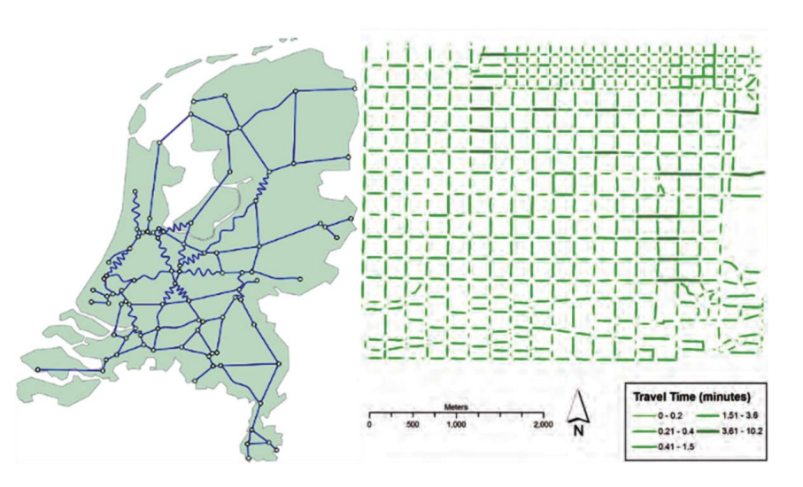
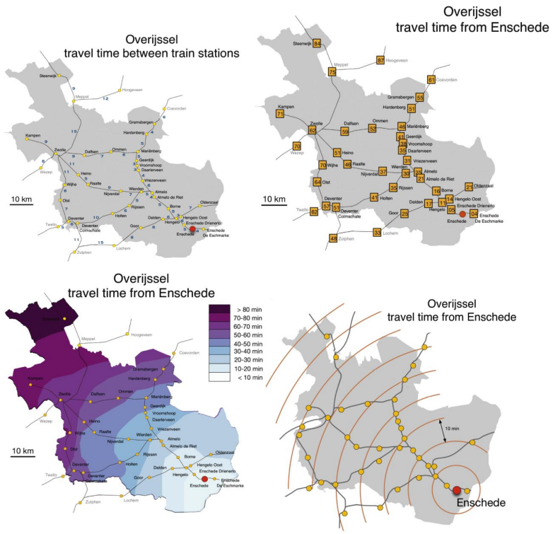
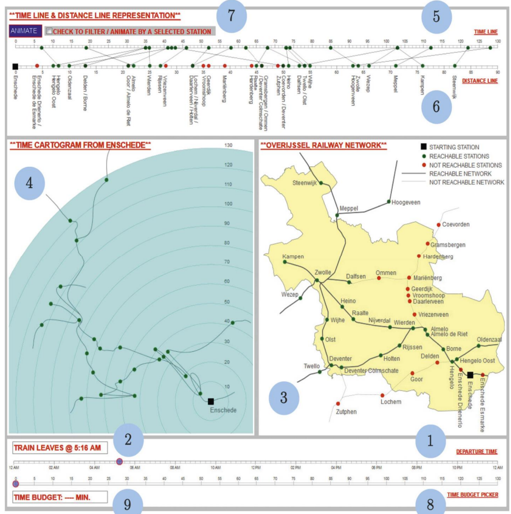
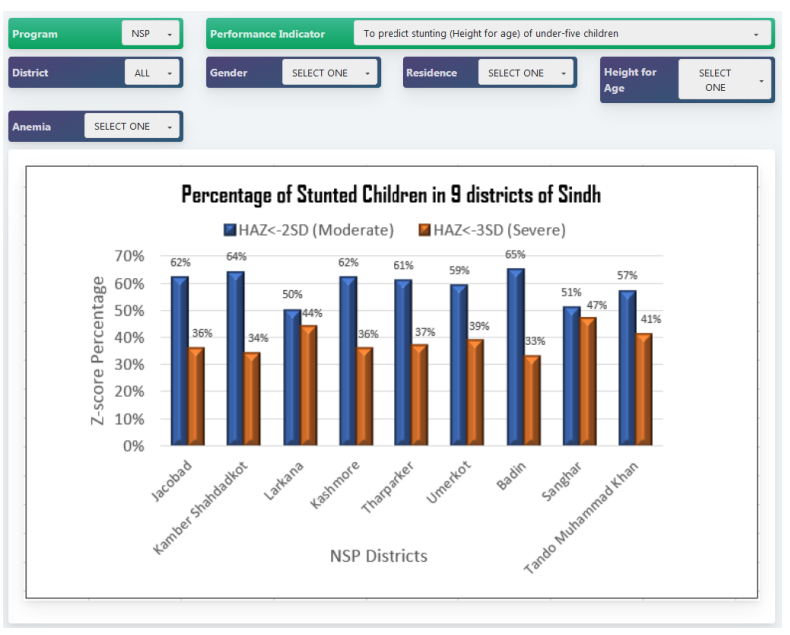
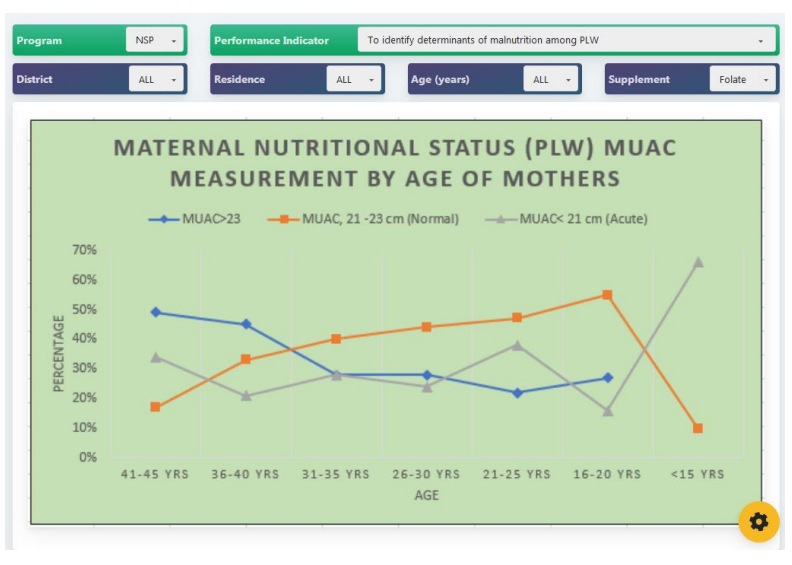
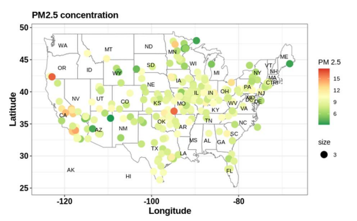
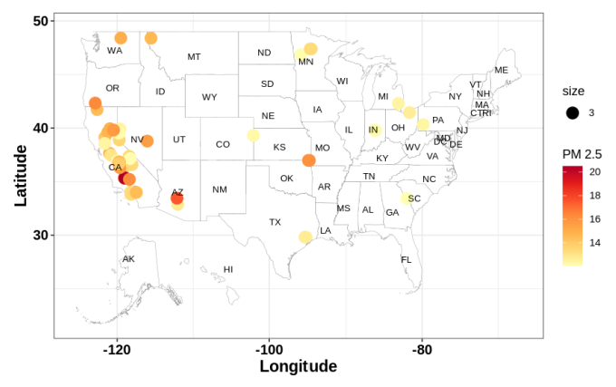
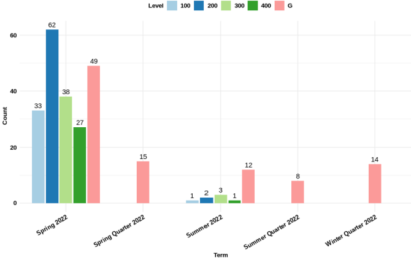
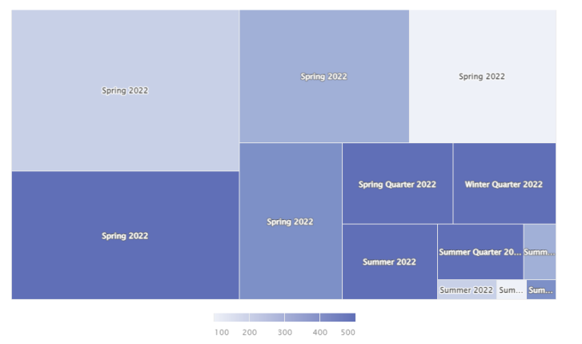

## Visualization Portfolio

In my B.Sc. Computer System Engineering (2016), I worked on the project (FYP) where I developed visualization as part of my project to show the **Reachability in Transport Networks in a Linked View Environment (using D3.js).**  I will add number of visualization to start with my portfolio for this work as below:

Left side of the figure above shows a linear cartogram with fixed vertex locations that depicts trip times for the Dutch railway network. The map and locations are constant, but the edges are shown as sinusoids to show trip times. In the right side part of the figure above shows the travel times in Salt Lake City, Utah, depicted via a non-connected linear cartogram. These cartograms do not depict the connection of line segments. The lengths and widths of road segments are adjusted based on journey times.

### Below map explanation: 
It is the mapping travel time by train from the city of Enschede to other towns in the Dutch province of Overijssel. The above left (up) part of the figure is labels along network segments. Above right (up) shows same information using labels at destinations. Down (left) part of the figure shows Isochrones map. Down (right) shows, time cartogram for the same amount of data using D3 JavaScript. 

### Below map explanation: 
The above visualization environment includes a time line (labeled = 5), a distance line (labeled = 6), a time prism (labeled 1, 2, 5, 6, 8, and 9), a geographic map (labeled 3), and a time cartogram (labelled 4). All views were interactive and connected, so dragging the mouse over a station in one view highlighted the associated station in another. All this was in linked view environment to show the imperativeness. This was my first visualization work that I did in my bachelors. 

### Dashboard Developement as RA:

As a part of this job, worked on dashboard for health data in 2020. Where I designed an interactive dashboard in order to visualize yearly, quarterly & monthly data for division, dist., & UC level of health department Sindh(province), Pakistan, using high-charts using diff-indicators. I have added some snaps to show to the work. Data was for different health indicators. 

### Graduate Student at CU: 
In the info-Visualization course in fall 2022, I worked on number of dataset and visualized the data in different forms. Below are some of the snaps for the visualization I did and I would like to add it to my portfolio as I learned a lot during this period of time and found it a field of science.

The map above of the United States shows the county-based Environmental Protection Agency (EPA) air monitoring network, with the colors representing PM2.5 concentrations in each county and below map shows similar data for concentrations more than 12 ug/m3 in each county.

This map shows unhealthy day’s base on AQI per county. This was part of project for info.Viz class for 2022. 

In one of our project for similar class in 2022 we showed Echo-360 data for Clarkson University and this is the overview of some visualization we came across. 

Below bar chart graph shows concentration of course number for each term (spring, quarter, summer, etc.). Next, interactive mosaic graph shows the clusters of size of class for box and color changes as the course number increase or decrease. 

