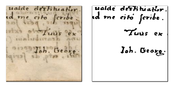
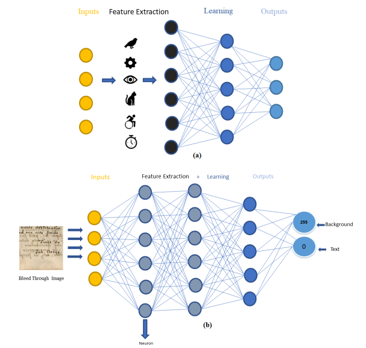
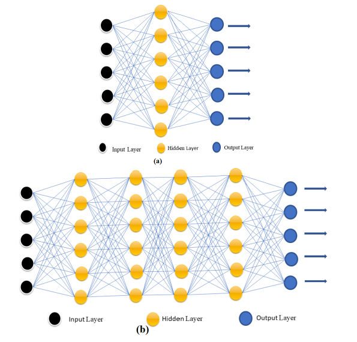
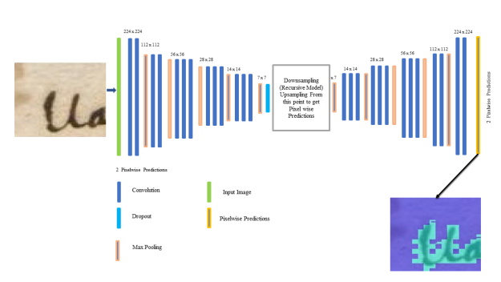
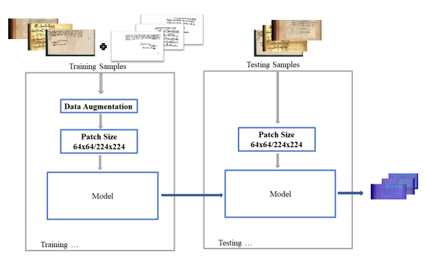
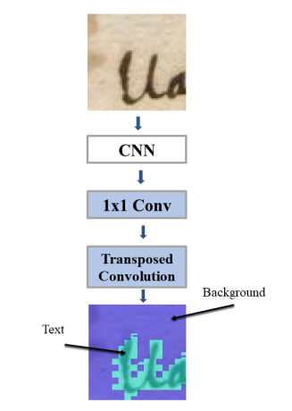
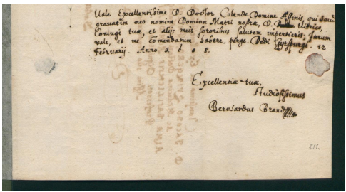
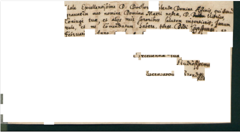
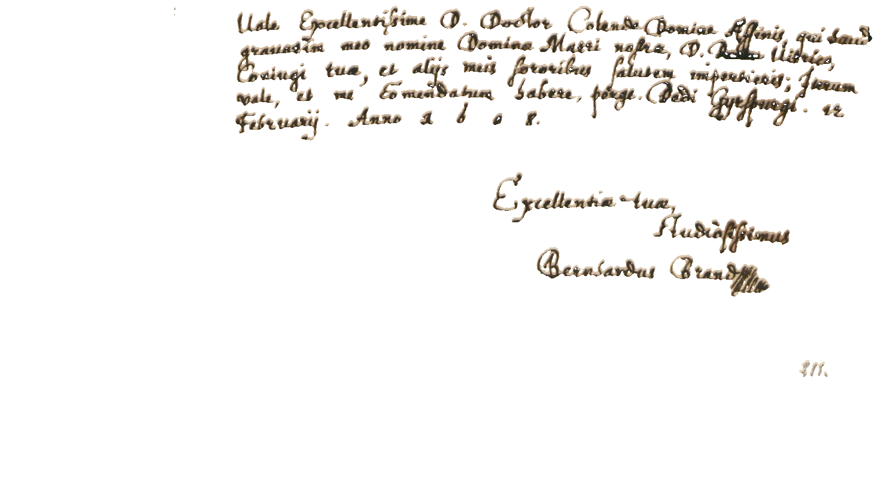

## Bleed-through Removal using ConvNets

### Summary
Bleed through is a document degradation problem where the ink used seeps into the foreground and background of a sheet. The two sides of the sheet are called recto-verso, where the recto is foreground and verso is the background. This phenomenon mostly occurs in ancient documents.Ancient documents contain useful information which is digitally stored for long term preservation. Further, machine learning techniques can employ optical character recognition for in-depth analysis on these documents. Bleed-through causes text interference and affects document readability. Recovering the original text and mitigating the effects of bleed-through is therefore a highly desired task.

The bleed-through removal problem is mostly formulated as classification problem, where each pixel needs to be assigned one of three classes; original foreground text, the background, and bleed-through. Further, this problem can also be formulated in the context of supervised and unsupervised learning. In the case of supervised learning, a human labeler has assigned per class labels to sample images containing foreground and bleed-through text. The proposed work solves this problem using supervised learning on ancient documents datasets. Further, our approach only uses the recto side information and can be useful in situation where the verso side information is not available.

Various techniques have been proposed to de-noise the bleed-through image and recover the original text. We deploy several deep learning algorithms to learn the clean image from a noisy one. Initially, we train a Convolutional Neural Network to classify an input patch as background, bleed-through, foreground and bleed-through, and clean text. However, the performance of this network was not satisfactory, later we model this problem as semantic segmentation problem, where each pixel is assigned a class label of text or background. We trained a Fully Convolutional Neural Network for this purpose. Experimental results show that the original text can be recovered from noisy images in good quality. On the test set samples, this approach achieved an average PSNR of 20 dB and visually appealing results. Finally, we fine-tuned the pre-trained VGG FCN models on our dataset, and further improved the results by 8%.

### Ancient Documents
For historians, knowledge of the past is preserved in ancient documents. As the time goes by these documents get exposed to different conditions, which affects their contents and different degradation occurs to them such as ink fades, vulnerable nature of written media, bad environmental conditions and storage options. This may cause total annihilation of these important written materials. Therefore, it is highly important to understand and preserve these manuscripts using computer vision techniques. Manuscripts where text has been written on both sides of the page, the ink has often slipped through and appears on the other side of the sheet as shown in Figure below 

This unwanted deterioration is in the handwritten documents is often called bleeding-through. In order to decipher or understand these old documents, computer vision techniques could play an important role.Therefore, in this work tried to solve this problem using ConvNets to get a clean image of uncleaned image after training our network on ancient images data. We evaluated different networks architectures and concluded that the results produced by Fully Convolutional Neural Network (FCN) are quite good. The learning philosophy deep learning and machine learning that I followed in this research. 

Convolutional Neural Networks (CNNs) are the most popular deep neural networks which process the 2D/3D data, e.g. images, very efficiently. CNNs are inspired from animal vision. These are different from ANNs in terms of feature extraction, dimensionality reduction and output a single classification result. CNNs have been successful in solving problems of pattern recognition, verification, classification, detection, detection, tracking and much more problems. In CNNs, we do not need to specify the features in the classifying images to be extracted and they work on the images during training process of the large amount to input data. After the model is trained new images are classified. Shallow Neural Network vs Deep Neural network.

### Problem Formulation with Fully Convolutional Network (FCN)

Our proposed network model learns from
the clean patches of bleed-through free documents images which are used for optimization. The proposed method is totally problem specific and uses full data driven technique. In this method, we use noisy image (bleed-through affected) in the input to get the corresponding clean image (bleed-through free) by doing semantic segmentation of pixels in the image and extract the true part from it. The overall working of the bleed-through removal and document restoration is shown in following figures. 

### FCN Working

Fully Convolutional Network(FCN) consists of convolutions, pooling and upsampling layers, while this network may not have any dense layer. In FCN, fully connected layers are transformed into convolutional layers. FCN accepts input of any size and output size is similar to the input. FCN uses CNN as shown above to semantically classify an input image. CNN provides predictions in the classification layer after the fully connected layer, while FCN transforms the input image from fully connected layer to the image height and width using transposed layer convolution. The result has therefor pixel-to-pixel correspondence between the input and output.

Further, FCN uses the structure of convolutional neural network for feature extraction, transforming the number of channels into the number of segmentation classes using 1×1 convolution layer. The transposed convolutional layer transforms the feature map dimension size to the input dimension size. The final output is the prediction of segmented class for the corresponding spatial position in input image as visualized below. 

## Some Resultant Cleaned Images

