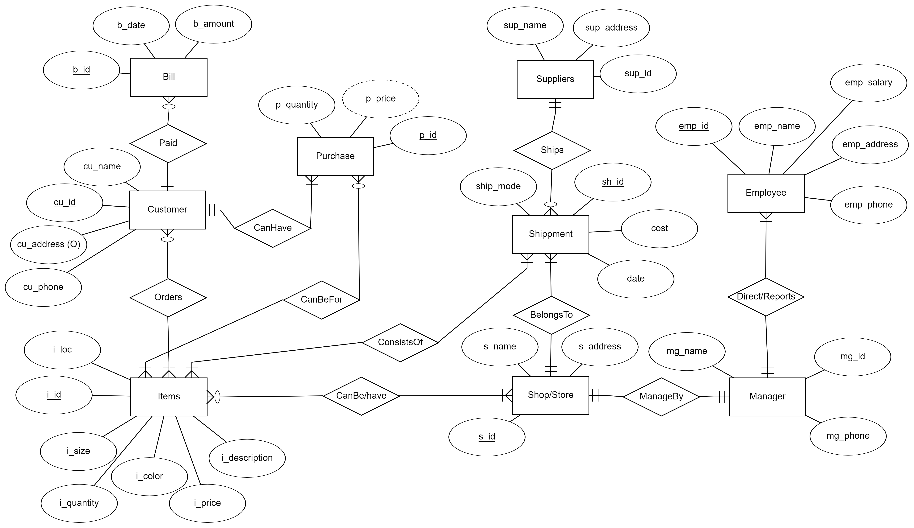
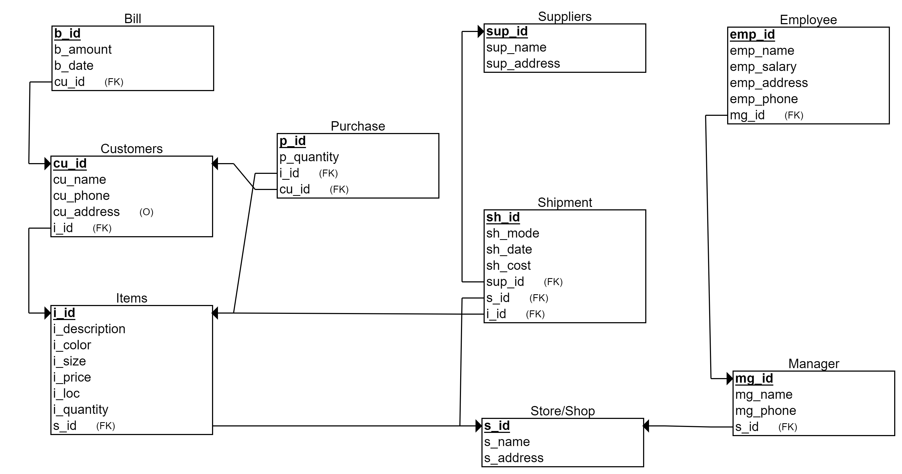
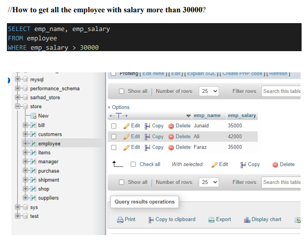
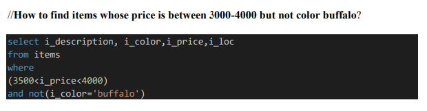
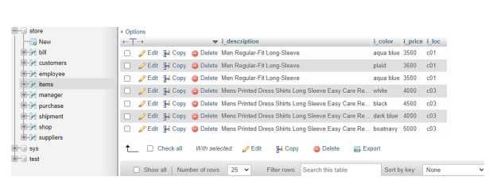
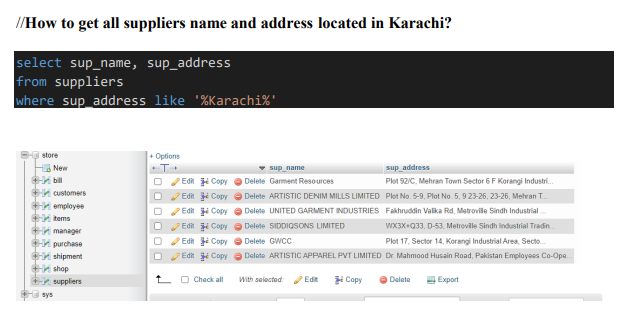
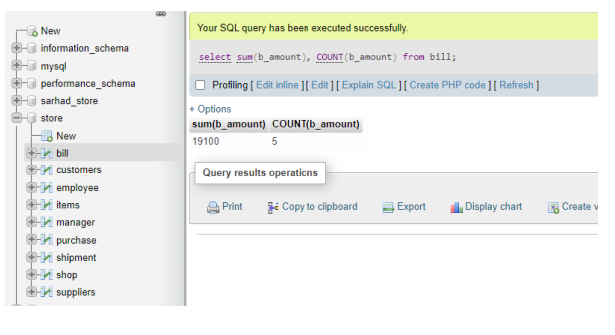
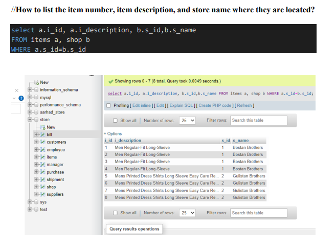

## Database Modeling, design and implementation project

### Project Summary
Database management system for cloth store business in Pakistan. There is both sale and purchase part associated with it and for now they are managed manually. It deals with on average 50 customers daily but deals with more than that on certain occasions like Eid, Christmas, etc. Cloths are of different types and different sizes which needs different kind of measurements. This systems will help automate the system and mainly target online customers or an ease for customers associated with this. 
### Database Requirements
The main purpose of this database system is to keep cover every aspect of the business and people associated with it. We wanted to create history of sell purchase for the clothing store run on smaller scale for now. 

The supplier is contacted through phone and asked for supply. Each supplier has name and address associated with it. Supplier ships the order with shipment id exchange who place the order. Shipment is sent through different mode of shipments and cost of shipment, date of shipment and shipment ID is required. 

Stores associated with the shop receives the shipment. It is similar to shop which has its name, physical address. Each store / shop is managed by a manager with name, phone number, and manages employers (sales man) at shop with employer ID, name, address, phone number, salary. 

Each shop/store contains different kinds of items. Each item has its item ID, name (description), color, quantity, size, location in store, price. Customer of any gender can purchase items. Customer has ID, name, address, phone number. Customers purchases items with purchase id, quantity of item, and will have price associated with it. Purchase can be for one or multiple items. Items can be either purchased by none or many customers. Customer pays bill with bill id, bill date and bill amount.

### Entity Relationship Diagram (ERD)
The first step in the creation of the database is an ERD model. The ERD model is based on the description shown above. The diagram is shown below:



### Relational Schema 
This section shows the relational schema with all the primary and foreign keys clearly specified.



### Database Schema with SQL

This section shows the SQL used to create the database and tables. You may include part of DML that was used to populate the tables with data.

I created manually database by name ‘store’, then created tables for above schema with data entry. (I mostly worked on localphpadmin sever using WampServer application).

#### Create table bill

```sql
--
-- Database: `store`
-- Table structure for table `bill`
--
DROP TABLE IF EXISTS `bill`;
CREATE TABLE IF NOT EXISTS `bill` (
  `b_id` int(11) NOT NULL,
  `b_amount` int(255) NOT NULL,
  `b_date` varchar(30) NOT NULL,
  `cu_id` int(11) NOT NULL,
  PRIMARY KEY (`b_id`),
  KEY `cu_id` (`cu_id`)
) ENGINE=InnoDB DEFAULT CHARSET=latin1;
```

#### Insert data in bill table 

```sql
--
-- Dumping data for table `bill`
--
INSERT INTO `bill` (`b_id`, `b_amount`, `b_date`, `cu_id`) VALUES
(1, 5000, '2004', 5),
(2, 3500, '2003', 1),
(3, 3500, '2003', 3),
(4, 3500, '2003', 2),
(5, 3600, '2003', 4);
```
#### Similarly other table and data 
```sql 
--
-- Table structure for table `customers`
--
DROP TABLE IF EXISTS `customers`;
CREATE TABLE IF NOT EXISTS `customers` (
  `cu_id` int(11) NOT NULL,
  `cu_name` varchar(255) NOT NULL,
  `cu_phone` varchar(30) NOT NULL,
  `cu_address` varchar(255) DEFAULT NULL,
  `i_id` int(11) NOT NULL,
  PRIMARY KEY (`cu_id`),
  KEY `i_id` (`i_id`)
) ENGINE=InnoDB DEFAULT CHARSET=latin1;
--
-- Dumping data for table `customers`
--
INSERT INTO `customers` (`cu_id`, `cu_name`, `cu_phone`, `cu_address`, `i_id`) VALUES
(1, 'Rashid', '315-261-9008', 'clarkson university', 1),
(2, 'VJ Kumar', '315-849-8572', 'clarkson university', 2),
(3, 'abdullah', '333-955-2696', 'karachi', 2),
(4, 'adeel', '333-123-4567', 'karachi', 3),
(5, 'zoya', '300-456-7890', 'lahore', 8);
-- --------------------------------------------------------
--
-- Table structure for table `employee`
--
DROP TABLE IF EXISTS `employee`;
CREATE TABLE IF NOT EXISTS `employee` (
  `emp_id` int(11) NOT NULL,
  `emp_name` varchar(255) NOT NULL,
  `emp_salary` int(20) NOT NULL,
  `emp_phone` varchar(30) NOT NULL,
  `emp_address` varchar(255) NOT NULL,
  `mg_id` int(11) NOT NULL,
  PRIMARY KEY (`emp_id`),
  KEY `mg_id` (`mg_id`)
) ENGINE=InnoDB DEFAULT CHARSET=latin1;
--
-- Dumping data for table `employee`
--
INSERT INTO `employee` (`emp_id`, `emp_name`, `emp_salary`, `emp_phone`, `emp_address`, `mg_id`) VALUES
(1, 'Tanvir Ahmad', 30000, '333-164-0000', 'sadar rawalpindi', 1),
(2, 'Junaid', 35000, '333-475-2893', 'Peshawar', 1),
(3, 'Ali', 42000, '300-777-1203', 'Nowshera', 1),
(4, 'Amjid', 25000, '316-988-2883', 'Nowshera', 2),
(5, 'Faraz', 35000, '315-000-0000', 'rawalpindi', 2);
-- --------------------------------------------------------
--
-- Table structure for table `items`
--
DROP TABLE IF EXISTS `items`;
CREATE TABLE IF NOT EXISTS `items` (
  `i_id` int(11) NOT NULL,
  `i_description` varchar(255) NOT NULL,
  `i_color` varchar(20) NOT NULL,
  `i_price` int(255) NOT NULL,
  `i_loc` varchar(10) NOT NULL,
  `i_quantity` int(20) NOT NULL,
  `s_id` int(11) NOT NULL,
  PRIMARY KEY (`i_id`),
  KEY `s_id` (`s_id`)
) ENGINE=InnoDB DEFAULT CHARSET=latin1;
--
-- Dumping data for table `items`
--
INSERT INTO `items` (`i_id`, `i_description`, `i_color`, `i_price`, `i_loc`, `i_quantity`, `s_id`) VALUES
(1, 'Men Regular-Fit Long-Sleeve', 'aqua blue', 3500, 'c01', 4, 1),
(2, 'Men Regular-Fit Long-Sleeve', 'buffalo', 3500, 'c02', 3, 1),
(3, 'Men Regular-Fit Long-Sleeve', 'plaid', 3600, 'c01', 2, 1),
(4, 'Men Regular-Fit Long-Sleeve', 'aqua blue', 3500, 'c01', 4, 1),
(5, 'Mens Printed Dress Shirts Long Sleeve Easy Care Regular Fit Casual Button Down Shirts', 'white', 4000, 'c03', 10, 2),
(6, 'Mens Printed Dress Shirts Long Sleeve Easy Care Regular Fit Casual Button Down Shirts', 'black', 4500, 'c03', 9, 2),
(7, 'Mens Printed Dress Shirts Long Sleeve Easy Care Regular Fit Casual Button Down Shirts', 'dark blue', 4000, 'c03', 10, 2),
(8, 'Mens Printed Dress Shirts Long Sleeve Easy Care Regular Fit Casual Button Down Shirts', 'boatnavy', 5000, 'c03', 5, 2);
-- --------------------------------------------------------
--
-- Table structure for table `manager`
--
DROP TABLE IF EXISTS `manager`;
CREATE TABLE IF NOT EXISTS `manager` (
  `mg_id` int(11) NOT NULL,
  `mg_name` varchar(255) NOT NULL,
  `mg_phone` varchar(30) NOT NULL,
  `s_id` int(11) NOT NULL,
  PRIMARY KEY (`mg_id`),
  KEY `s_id` (`s_id`)
) ENGINE=InnoDB DEFAULT CHARSET=latin1;
--
-- Dumping data for table `manager`
--
INSERT INTO `manager` (`mg_id`, `mg_name`, `mg_phone`, `s_id`) VALUES
(1, 'Ejaz Khan', '0333-9552696', 1),
(2, 'Majid', '0300-5118473', 2);
-- --------------------------------------------------------
--
-- Table structure for table `purchase`
--
DROP TABLE IF EXISTS `purchase`;
CREATE TABLE IF NOT EXISTS `purchase` (
  `p_id` int(11) NOT NULL,
  `p_quantity` int(15) NOT NULL,
  `i_id` int(11) NOT NULL,
  `cu_id` int(11) NOT NULL,
  PRIMARY KEY (`p_id`),
  KEY `i_id` (`i_id`),
  KEY `cu_id` (`cu_id`)
) ENGINE=InnoDB DEFAULT CHARSET=latin1;
--
-- Dumping data for table `purchase`
--
INSERT INTO `purchase` (`p_id`, `p_quantity`, `i_id`, `cu_id`) VALUES
(1, 1, 1, 1),
(2, 1, 2, 2),
(3, 1, 2, 3),
(4, 1, 3, 4),
(5, 1, 8, 5);
-- --------------------------------------------------------
--
-- Table structure for table `shipment`
--
DROP TABLE IF EXISTS `shipment`;
CREATE TABLE IF NOT EXISTS `shipment` (
  `sh_id` int(11) NOT NULL AUTO_INCREMENT,
  `sh_mode` varchar(30) NOT NULL,
  `sh_date` varchar(30) NOT NULL,
  `sh_cost` int(255) NOT NULL,
  `sup_id` int(11) NOT NULL,
  `s_id` int(11) NOT NULL,
  `i_id` int(11) NOT NULL,
  PRIMARY KEY (`sh_id`),
  KEY `sup_id` (`sup_id`),
  KEY `s_id` (`s_id`),
  KEY `i_id` (`i_id`)
) ENGINE=InnoDB AUTO_INCREMENT=4 DEFAULT CHARSET=latin1;
--
-- Dumping data for table `shipment`
--
INSERT INTO `shipment` (`sh_id`, `sh_mode`, `sh_date`, `sh_cost`, `sup_id`, `s_id`, `i_id`) VALUES
(1, 'air cargo', '2022-12-01', 10500, 1, 1, 1),
(2, 'train cargo', '2022-12-2', 30000, 2, 1, 2),
(3, 'bus cargo', '2022-12-3', 50000, 3, 2, 2);
-- --------------------------------------------------------
--
-- Table structure for table `shop`
--
DROP TABLE IF EXISTS `shop`;
CREATE TABLE IF NOT EXISTS `shop` (
  `s_id` int(11) NOT NULL,
  `s_name` varchar(255) NOT NULL,
  `s_address` varchar(255) NOT NULL,
  PRIMARY KEY (`s_id`)
) ENGINE=InnoDB DEFAULT CHARSET=latin1;
--
-- Dumping data for table `shop`
--
INSERT INTO `shop` (`s_id`, `s_name`, `s_address`) VALUES
(1, 'Bostan Brothers', 'B07 Barkat Plaza, Rawalpindi, Punjab, Pakistan'),
(2, 'Gulistan Brothers', 'B10 Barkat Plaza, Rawalpindi, Punjab, Pakistan');
-- --------------------------------------------------------
--
-- Table structure for table `suppliers`
--
DROP TABLE IF EXISTS `suppliers`;
CREATE TABLE IF NOT EXISTS `suppliers` (
  `sup_id` int(11) NOT NULL,
  `sup_name` varchar(255) NOT NULL,
  `sup_address` varchar(255) NOT NULL,
  PRIMARY KEY (`sup_id`)
) ENGINE=InnoDB DEFAULT CHARSET=latin1;
--
-- Dumping data for table `suppliers`
--
INSERT INTO `suppliers` (`sup_id`, `sup_name`, `sup_address`) VALUES
(1, 'Garment Resources', 'Plot 92/C, Mehran Town Sector 6 F Korangi Industrial Area, Karachi, Karachi City, Sindh, Pakistan'),
(2, 'RIJIZ INTERNATIONAL', 'Besides Majeed Honda, near Tulip Marquee, Nawan Pind Araian, Sialkot, Punjab 51310, Pakistan'),
(3, 'INTERLOOP LIMITED PAK', '1-Km Jaranwala Rd, Khurianwala, Faisalabad, Punjab, Pakistan'),
(4, 'ARTISTIC DENIM MILLS LIMITED', 'Plot No. 5-9, Plot No. 5, 9 23-26, 23-26, Mehran Town Sector 16 Korangi Industrial Area, Karachi, Karachi City, Sindh 74900, Pakistan'),
(5, 'NISHAT APPAREL', '2-km, Nishat Avenue Off 22-km Ferozepur, Road, Lahore, 54600, Pakistan'),
(6, 'FOCUS SPORTS', 'Bismillah Chowk, Pasrur Road, Bhiko Chohar Village Sialkot, Punjab 51310, Pakistan'),
(7, 'UNITED GARMENT INDUSTRIES', 'Fakhruddin Valika Rd, Metroville Sindh Industrial Trading Estate, Karachi, Karachi City, Sindh, Pakistan'),
(8, 'SIDDIQSONS LIMITED', 'WX3X+Q33, D-53, Metroville Sindh Industrial Trading Estate, Karachi, Karachi City, Sindh, Pakistan'),
(9, 'ZK INTERNATIONAL', 'Raja Ghulam, P-841 Street Number 6, Rasool Nagar Al Masoom Town, Faisalabad, Punjab 38000, Pakistan'),
(10, 'GWCC', 'Plot 17, Sector 14, Korangi Industrial Area, Sector 14 Karachi, Karachi City, Sindh 74900, Pakistan'),
(11, 'LAHORE FASHIONS PVT LTD', 'Street Number 2, Malikpur, Faisalabad, Punjab, Pakistan'),
(12, 'ARTISTIC APPAREL PVT LIMITED', 'Dr. Mahmood Husain Road, Pakistan Employees Co-Operative Housing Society Block 6 PECHS, Karachi, Karachi City, Sindh, Pakistan');
--
-- Constraints for table `bill`
--
ALTER TABLE `bill`
  ADD CONSTRAINT `bill_ibfk_1` FOREIGN KEY (`cu_id`) REFERENCES `customers` (`cu_id`);
--
-- Constraints for table `customers`
--
ALTER TABLE `customers`
  ADD CONSTRAINT `customers_ibfk_1` FOREIGN KEY (`i_id`) REFERENCES `items` (`i_id`);
--
-- Constraints for table `employee`
--
ALTER TABLE `employee`
  ADD CONSTRAINT `employee_ibfk_1` FOREIGN KEY (`mg_id`) REFERENCES `manager` (`mg_id`);
--
-- Constraints for table `items`
--
ALTER TABLE `items`
  ADD CONSTRAINT `items_ibfk_1` FOREIGN KEY (`s_id`) REFERENCES `shop` (`s_id`);
--
-- Constraints for table `manager`
--
ALTER TABLE `manager`
  ADD CONSTRAINT `manager_ibfk_1` FOREIGN KEY (`s_id`) REFERENCES `shop` (`s_id`);
--
-- Constraints for table `purchase`
--
ALTER TABLE `purchase`
  ADD CONSTRAINT `purchase_ibfk_1` FOREIGN KEY (`i_id`) REFERENCES `items` (`i_id`),
  ADD CONSTRAINT `purchase_ibfk_2` FOREIGN KEY (`cu_id`) REFERENCES `customers` (`cu_id`);
--
-- Constraints for table `shipment`
--
ALTER TABLE `shipment`
  ADD CONSTRAINT `shipment_ibfk_1` FOREIGN KEY (`sup_id`) REFERENCES `suppliers` (`sup_id`),
  ADD CONSTRAINT `shipment_ibfk_2` FOREIGN KEY (`s_id`) REFERENCES `shop` (`s_id`),
  ADD CONSTRAINT `shipment_ibfk_3` FOREIGN KEY (`i_id`) REFERENCES `items` (`i_id`);
COMMIT;
```
### Sample Queries 















We have exported the database from my system and attached it to my project file by name ‘store.sql’. We have also attached the file where we typed Create, insert and sample queries file by name ‘create_insert_sampleQ.sql’ and ERD and Schema high resolution pictures. 

Further, we started designing front-end (see preview below) for it and do all the essential back-end and further improvements do database designed as required by potential users


