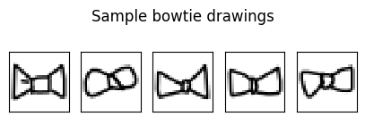
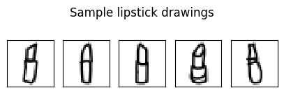
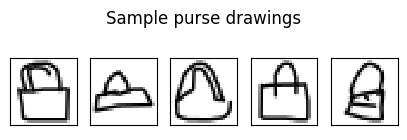
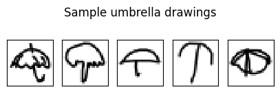
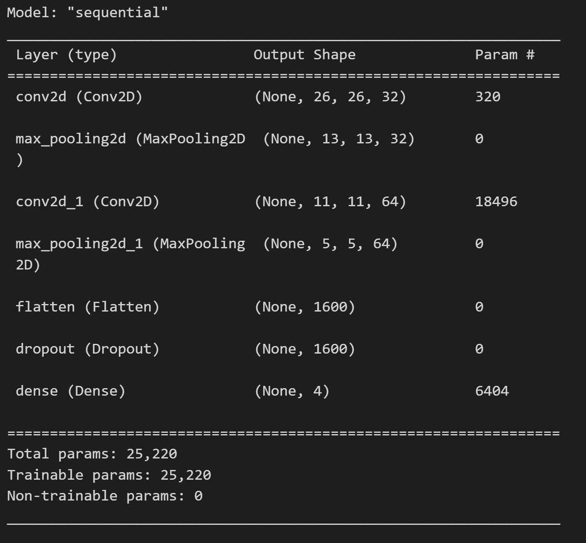
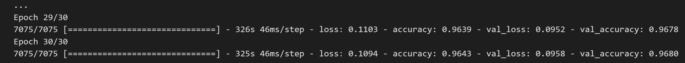
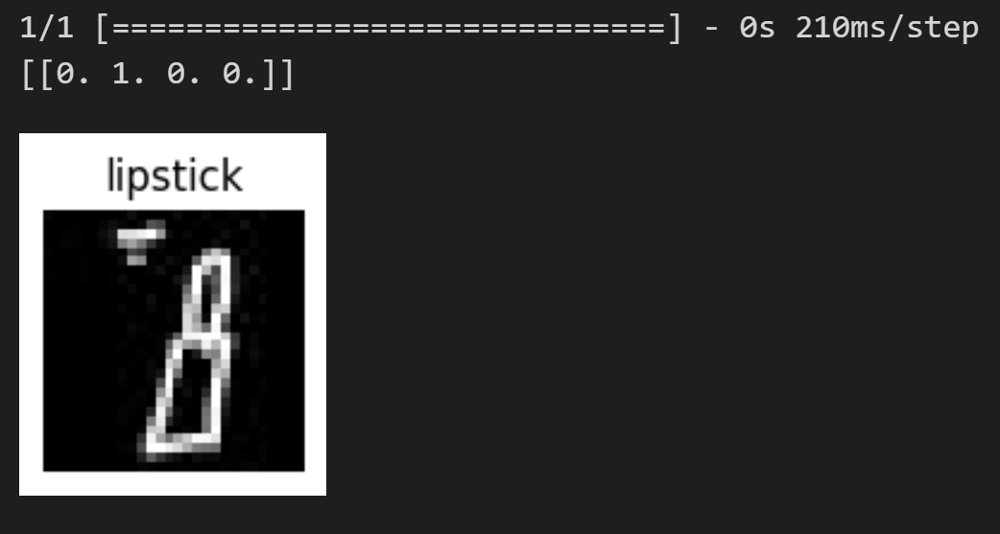
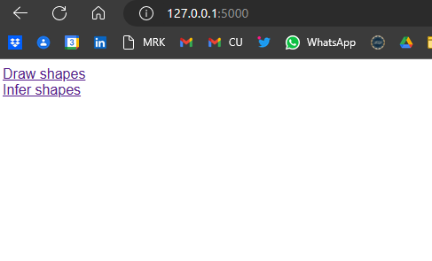
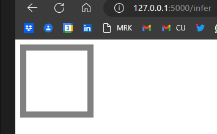
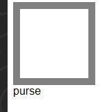

# Quick Draw! Doodle Recognition for Fashion Accessories
## Project Report

#### Muhammad Rashid
##### Department of Data Analytics, Clarkson University

## Abstract
Quick Draw Dataset consists of around 50million drawings which are the resultant of Quick, Draw game. The player starts with an object to draw (for example it may say "Draw a chair in under 20 seconds"). Then the player has twenty seconds to draw that object. Based on what they draw, the AI guesses what they are drawing. This project is inspired from the same game where we here have trained our model on four fashion accessories [bowtie, umbrella, lipstick, purse] only. In this project I tried to analyzed drawings of fashion and build CNN model trained on similar images of size (28,28). Finally the trained model can be used for inference purpose using Flask application that we learned in our applied machine learning course, where the user draws image of similar nature and gets predictions of its drawing using the trained model. 

## Project Structure: 
As an image recognition problem, I will build the solution which will classify the input images by the user. 
1. Downloading Dataset, loading dataset, data analysis
2. Classificatin model 
3. Evaluation of model - accuracy will be the metrics in our case
4. Web-application to benefit from trained classifier using Flask

## Dataset
- Raw data in .npy files downloaded from https://storage.googleapis.com/quickdraw_dataset/full/numpy_bitmap/ as .npy for the following categories.
categories = ['bowtie', 'lipstick','purse','sock','umbrella','wristwatch']
- extracting images from the .npy files as 
- We can also use follwoing function to download and load data as train and test sets but to simplify I have downloaded the dataset as .npy file for each class that I want to trained my model on. 
```python
def load_data():
    print("Loading data \n")
    # Check for already loaded datasets
    if not(path.exists('xtrain.pickle')):
        # Load from web
        print("Loading data from the web \n")

        # Classes we will load
        categories = ['bowtie', 'lipstick','purse','sock','umbrella']

        # Dictionary for URL and class labels
        URL_DATA = {}
        for category in categories:
            URL_DATA[category] = 'https://storage.googleapis.com/quickdraw_dataset/full/numpy_bitmap/' + category +'.npy'

        # Load data for classes in dictionary
        classes_dict = {}
        for key, value in URL_DATA.items():
            response = requests.get(value)
            classes_dict[key] = np.load(BytesIO(response.content))

        # Generate labels and add labels to loaded data
        for i, (key, value) in enumerate(classes_dict.items()):
            value = value.astype('float32')/255.
            if i == 0:
                classes_dict[key] = np.c_[value, np.zeros(len(value))]
            else:
                classes_dict[key] = np.c_[value,i*np.ones(len(value))]

        lst = []
        for key, value in classes_dict.items():
            lst.append(value[:3000])
        doodles = np.concatenate(lst)

        # Split the data into features and class labels (X & y respectively)
        y = doodles[:,-1].astype('float32')
        X = doodles[:,:784]

        # Split each dataset into train/test splits
        X_train, X_test, y_train, y_test = train_test_split(X,y,test_size=0.3,random_state=1)
    else:
        # Load data from pickle files
        print("Loading data from pickle files \n")

        file = open("xtrain.pickle",'rb')
        X_train = pickle.load(file)
        file.close()

        file = open("xtest.pickle",'rb')
        X_test = pickle.load(file)
        file.close()

        file = open("ytrain.pickle",'rb')
        y_train = pickle.load(file)
        file.close()

        file = open("ytest.pickle",'rb')
        y_test = pickle.load(file)
        file.close()

    return X_train, y_train, X_test, y_test
```
``` python
# loadind dataset
import numpy as np
bowtie = np.load('npy_files/bowtie.npy')
lipstick = np.load('npy_files/lipstick.npy')
purse = np.load('npy_files/purse.npy')
umbrella = np.load('npy_files/umbrella.npy')
print(bowtie.shape)
print(lipstick.shape)
print(purse.shape)
print(umbrella.shape)

```
Dataset classes are shaped as: 
- (130283, 784) - bowtie class (number of images, size)
- (127623, 784) - lipstick class
- (123320, 784) - purse class
- (124084, 784) - umbrella class

These are simplified drawings aligned to center in 28x28 grayscale bitmaps in numpy format. As we can load them easily using numpy as np.load(). As I have previously worked with numpy format in this course I will use this format of data available for the project. 

Next, I will reshape the numpy loaded classes to extract images from it and save it in my structure folders, used as classes. For the purpose of this project I will divide the data into 70/30 split for train/validation purpose of model training as shown in the code too. My code will create the folder if not created and save the images to it in the specific classes folder (folders named as class name). 

```python
n = round(len(bowtie)* 0.30)
images_reshaped = bowtie.reshape((-1, 28, 28))
path_shapes = 'shapes/bowtie/'
path_val_shapes = 'val_shapes/bowtie/'
```
Creating folders if not available: 
```python
import os
# this code will make sure the folders exists
if not os.path.exists(path_shapes):
    os.makedirs(path_shapes)

if not os.path.exists(path_val_shapes):
    os.makedirs(path_val_shapes)

```
Next, I will use PIL image library to extract image from arrays and saved it as 28x28 images in class folders. 
```python
from PIL import Image
# Loop over each image and save it as a JPG file
for i, image in enumerate(images_reshaped ):
    # Convert the image from a NumPy array to a Pillow Image object
    image = Image.fromarray(image.astype('uint8'), mode='L')
    if i >= n:
        # Save the image as a PNG file
        filename = f"image_{i:04}.jpg"
        # Combine the folder path and file name
        file_path = os.path.join(path_shapes, filename)
        image.save(file_path)
    else: 
        filename = f"image_{i:04}.jpg"
        file_path = os.path.join(path_val_shapes, filename)
        image.save(file_path)
```

To Draw few sample drawings from the dataset loaded, following snip of code can be used: 
```python
# add a column with labels, 0=bowtie, 1=lipstick, 2=purse, 3=umbrella 
bowtie_ = np.c_[bowtie, np.zeros(len(bowtie))]
lipstick_ = np.c_[lipstick, np.ones(len(lipstick))]
purse_ = np.c_[purse, 2*np.ones(len(purse))]
umbrella_ = np.c_[umbrella, 3*np.ones(len(umbrella))]
```
```python
import matplotlib.pyplot as plt
# Function to plot 28x28 pixel drawings that are stored in a numpy array.
# Specify how many rows and cols of pictures to display (default 4x5).  
# If the array contains less images than subplots selected, surplus subplots remain empty.
def plot_sample_images(input_array, rows=1, cols=5, title=''):
    fig, ax = plt.subplots(figsize=(cols,rows))
    ax.axis('off')
    plt.title(title)

    for i in list(range(0, min(len(input_array),(rows*cols)) )):      
        a = fig.add_subplot(rows,cols,i+1)
        imgplot = plt.imshow(input_array[i,:784].reshape((28,28)), cmap='gray_r', interpolation='nearest')
        plt.xticks([])
        plt.yticks([])
```
```python
# Plot samples
plot_sample_images(bowtie_, title='Sample bowtie drawings\n')
plot_sample_images(lipstick_, title = 'Sample lipstick drawings\n')
plot_sample_images(purse_, title = 'Sample purse drawings\n')
plot_sample_images(umbrella_, title = 'Sample umbrella drawings\n')
```
#### Resultant samples will be like: 









## Building Model

Loading essential libraries
```python
import tensorflow as tf
from tensorflow.keras.models import Sequential
from tensorflow.keras.layers import Dense, Conv2D, Flatten, Dropout, MaxPooling2D
from tensorflow.keras.preprocessing.image import ImageDataGenerator, img_to_array, load_img
import os
import numpy as np
import matplotlib.pyplot as plt
```

Defining the hyperparameters and folders paths for train and validation. My training images are in shapes folder, and val_shapes. Used 30 epochs for training purpose. Input image size (28, 28)

```python
batch_size = 50
epochs = 30
IMG_HEIGHT = 28
IMG_WIDTH = 28
TRAIN_PATH = 'shapes'
VAL_PATH = 'val_shapes'
```
Benefiting from the tensorflow keras library method for reading training and validation data from directory structure. Total of 353717 training images and 151593 images for validation purpose with 4-classes.
```python
train_data =  tf.keras.utils.image_dataset_from_directory(
    batch_size=batch_size,
    label_mode='int',
    directory=TRAIN_PATH,
    color_mode="grayscale",
    shuffle=True,
    image_size=(IMG_HEIGHT, IMG_WIDTH))
```
```python
val_data =  tf.keras.utils.image_dataset_from_directory(
    batch_size=batch_size,
    label_mode='int',
    directory=VAL_PATH,
    shuffle=True,
    color_mode="grayscale",
    image_size=(IMG_HEIGHT, IMG_WIDTH))
```
To see the training data samples loaded:
```python
import matplotlib.pyplot as plt

plt.figure(figsize=(10, 10))
for images, labels in train_data.take(1):
  for i in range(9):
    ax = plt.subplot(3, 3, i + 1)
    #print(images[i].numpy().max())
    plt.imshow(images[i].numpy(),cmap='gray' )
    plt.title(class_names[labels[i]])
    plt.axis("off")
```
I have build my CNN model with tensorflow keras. Layers sizes are as follows:
- Input layer : 784(28 x 28) sized images
- Hidden Conv2D layer : 32 Neuron, filter, kernel size (3x3) using activativation function 'relu'
- Max Pooling layer : (2x2) to decrease size of resultant image - encoding
- Hidden Conv2D layer : 64 Neuron, kernel size (3x3), 'relu' as activation
- Max pooling layer: (2x2)
- Flatten the output
- 50% drop out in dropout layer
- Dense layer : using sofmax as probablistic function

- Optimizer used for this model is 'adam' and loss function as 'sparse_categorical_crossentropy'. We can also test with SGD as optimizer here. 
```python
#Build the model
from tensorflow.keras import layers
model = Sequential([
    layers.Input(shape=(IMG_HEIGHT,IMG_WIDTH,1)),
    layers.Conv2D(32, kernel_size=(3, 3), activation="relu"),
    layers.MaxPooling2D(pool_size=(2, 2)),
    layers.Conv2D(64, kernel_size=(3, 3), activation="relu"),
    layers.MaxPooling2D(pool_size=(2, 2)),
    layers.Flatten(),
    layers.Dropout(0.5),
    layers.Dense(len(class_names), activation="softmax"),
])
# Compile the model
model.compile(optimizer='adam',              
              loss="sparse_categorical_crossentropy",              
              metrics=['accuracy'])
# print the model architecture
model.summary()
```



Fit the model for training: 

```python
history = model.fit(
    train_data,
    epochs=epochs,
    validation_data=val_data
)
```



Check the model trained on the single images as an input to see what is the resultant prediction 
```python
for images, labels in train_data.take(1):
    for i in range(1):
        ax = plt.subplot(3, 3, i + 1)
        #print(images[i].numpy().max())
        plt.imshow(images[i].numpy(),cmap='gray' )
        plt.title(class_names[labels[i]])
        plt.axis("off")
        print(np.round(model.predict(images[:1])))
```


We can save the model for inference purpose will save the model to folder shapes_v1 in current working directory. 
```python
model.save('shapes_v1')
```
Loading model for later such as training on new data will be as: 
```python
from tensorflow import keras
model = keras.models.load_model('shapes_v1')
```

## Building a Web-Application: 
The goal of the web application is to show how the model can recognize the image drawn by the application's user. The final application should allow the user to:
1. Drawing image of size (28,28) using mouse in one click
2. As the user release the mouse the drawing is sent to the model for inferencing and response is printed.

For this purpose I used Flask, HTML, Bootstrap and json, tensorflow and other libraries essential. Web application front end has two purposes: 
- Draw new image (for building the new dataset)
- Inferencing image

## Front End:

Running the app.py file on the project folder will result in the following interfeace where a user can draw new images which will be saved to 'data' folder on the project file and latter can be used for newly training model. 



As we want to inference some images on the trained model, we click the infer shapes page link and get the following interface for image input. 



The model resultant probablities will be print to screen as json object which can be converted to class of prediction.



## Back end:

- The Flask server application will load the pretrained model for inference from folder shapes_v1
- Receives base64 encoded drawing from front end
- Preprocssing the drawing image
- Pass the processed image to loaded model
- Prints the probablities for resultant image as json object on screen


```python 
def infer_doodle():
    b64_text = request.form.get('image')
    img_data = str.encode(b64_text.split(',')[-1])#pull just the data off the b64 header from the URL image data
    img = None
    label_dict = {0:'bowtie',1:'lipstick', 2:'purse', 3:'sock', 4:'umbrella'}
    try: 
        img = base64.decodebytes(img_data)
    except:
        pass
    if img is not None:
        
        model = keras.models.load_model('shapes_v1')
        img = Image.open(io.BytesIO(img))
        img = img.convert('L')
        img = img.resize(target_size, Image.NEAREST)
        input_arr = tf.keras.utils.img_to_array(img)
        input_arr = np.array([input_arr])  # Convert single image to a batch.
        result1 = model.predict(input_arr)[0]
        label = np.argmax(result1)
        label_name = label_dict[label]
        print(label_name)
        result = result1.tolist()
        result = [ round(elem,2) for elem in result ]
        print(result)

        return jsonify({
                    'result':label_name,
                    'msg': 'success', 
                    'size': [img.width, img.height], 
                    'format': img.format
            })
    else:
        return jsonify({
                    'msg': 'failed - b64 image not sent.'
            }) 
```

